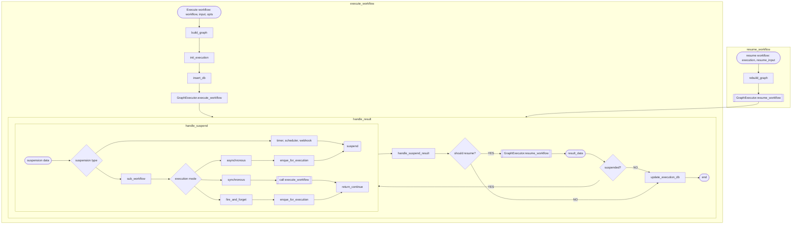

# Prana Application Integration Guide: Suspension/Resume Flows

**Version**: 1.0
**Date**: December 2024
**Purpose**: Guide applications to integrate async coordination patterns with Prana

---

## 🎯 **Overview**

Prana provides a **unified suspension/resume mechanism** for async coordination patterns. Applications handle external integrations through middleware while Prana coordinates workflow execution.

### **Supported Patterns**
1. **External Event Coordination** - Webhooks, human approvals, manual triggers
2. **Sub-workflow Orchestration** - Parent-child workflow execution
3. **External System Polling** - API status monitoring with conditions
4. **Time-based Delays** - Scheduled execution with flexible duration
5. **Node Retry Mechanism** - Automatic retry of failed nodes with configurable delay and limits

---

## 🏗️ **Core Architecture**

### **Integration Flow**



### **Key Components**
- **Prana Library**: Execution coordination, suspension/resume APIs
- **Application Middleware**: Handles suspension events and external integration
- **External Systems**: Webhooks, databases, timers, HTTP APIs (application manages)

---

## 📋 **Integration Steps**

### **Step 1: Create Suspension Middleware**

Create middleware to handle all suspension types:

```elixir
defmodule MyApp.SuspensionMiddleware do
  @behaviour Prana.Behaviour.Middleware

  require Logger

  def call(:node_suspended, data, next) do
    Logger.info("Workflow #{data.execution_id} suspended: #{data.suspend_type}")

    case data.suspend_type do
      :external_event -> handle_external_event_suspension(data)
      :sub_workflow -> handle_sub_workflow_suspension(data)
      :polling -> handle_polling_suspension(data)
      :delay -> handle_delay_suspension(data)
      unknown -> Logger.error("Unknown suspension type: #{unknown}")
    end

    next.(data)
  end

  def call(:node_resumed, data, next) do
    Logger.info("Workflow #{data.execution_id} resumed")
    cleanup_suspension_resources(data.execution_id)
    next.(data)
  end

  def call(:workflow_cancelled, data, next) do
    Logger.info("Workflow #{data.execution_id} cancelled: #{data.reason}")
    cleanup_suspension_resources(data.execution_id)
    next.(data)
  end

  def call(event, data, next), do: next.(data)

  # Implementation methods below...
end
```

### **Step 2: Configure Prana with Middleware**

Add your suspension middleware to Prana's configuration:

```elixir
# In your application configuration
config :my_app, :prana_middleware, [
  MyApp.LoggingMiddleware,
  MyApp.SuspensionMiddleware,  # <- Add your suspension middleware
  MyApp.PersistenceMiddleware
]

# In your application startup
defmodule MyApp.Application do
  def start(_type, _args) do
    # Configure Prana with middleware
    Prana.Middleware.configure(Application.get_env(:my_app, :prana_middleware))

    children = [
      # Your other supervisors...
    ]

    Supervisor.start_link(children, strategy: :one_for_one)
  end
end
```

---

## 🔄 **Use Case Implementations**

### **Use Case 1: External Event Coordination**

**Integration Setup**:
```elixir
# Add to your workflow
%Prana.Node{
  id: "wait_approval",
  type: :action,
  integration_name: "wait",
  action_name: "wait_for_event",
  settings: %{
    "event_type" => "approval_response",
    "event_filter" => %{"request_id" => "$input.request_id"},
    "timeout_ms" => 86400000,  # 24 hours
    "on_timeout" => "escalate"
  }
}
```

**Middleware Implementation**:
```elixir
defp handle_external_event_suspension(data) do
  suspension_data = data.suspension_data
  execution_id = data.execution_id

  # 1. Save suspension state to database
  MyApp.Database.save_suspended_workflow(%{
    execution_id: execution_id,
    suspend_type: :external_event,
    event_type: suspension_data["event_type"],
    event_filter: suspension_data["event_filter"],
    suspended_at: DateTime.utc_now(),
    timeout_at: DateTime.add(DateTime.utc_now(), suspension_data["timeout_ms"], :millisecond)
  })

  # 2. Register for event notifications
  MyApp.EventRouter.register_waiting_workflow(execution_id, suspension_data["event_type"], suspension_data["event_filter"])

  # 3. Schedule timeout handling
  MyApp.Scheduler.schedule_timeout(execution_id, suspension_data["timeout_ms"], suspension_data["on_timeout"])

  :ok
end
```

**Event Handler**:
```elixir
defmodule MyApp.WebhookController do
  def handle_approval_webhook(conn, params) do
    event_data = parse_webhook_data(params)

    # Find workflows waiting for this event
    waiting_workflows = MyApp.Database.find_workflows_waiting_for_event(
      event_data.type,
      event_data.filter_criteria
    )

    # Resume each matching workflow
    Enum.each(waiting_workflows, fn suspended_workflow ->
      case Prana.WorkflowManager.resume_workflow(suspended_workflow.execution_id, event_data) do
        {:ok, _result} ->
          MyApp.Database.mark_workflow_resumed(suspended_workflow.execution_id)
        {:error, reason} ->
          Logger.error("Failed to resume workflow: #{reason}")
      end
    end)

    json(conn, %{status: "processed", count: length(waiting_workflows)})
  end
end
```

### **Use Case 2: Sub-workflow Orchestration**

**Integration Setup**:
```elixir
# Add to your workflow
%Prana.Node{
  id: "user_onboarding",
  type: :action,
  integration_name: "workflow",
  action_name: "execute_workflow",
  settings: %{
    "workflow_id" => "user_onboarding_flow",
    "input_data" => "$input",
    "wait_for_completion" => true,
    "timeout_ms" => 300000  # 5 minutes
  }
}
```

**Middleware Implementation**:
```elixir
defp handle_sub_workflow_suspension(data) do
  suspension_data = data.suspension_data
  execution_id = data.execution_id

  # 1. Load sub-workflow
  case MyApp.WorkflowLoader.load_workflow(suspension_data["workflow_id"]) do
    {:ok, sub_workflow} ->
      # 2. Execute sub-workflow
      case MyApp.WorkflowRunner.execute_workflow(sub_workflow, suspension_data["input_data"]) do
        {:ok, sub_execution_id} ->
          # 3. Track parent-child relationship
          MyApp.Database.save_workflow_relationship(%{
            parent_execution_id: execution_id,
            child_execution_id: sub_execution_id,
            created_at: DateTime.utc_now()
          })

          # 4. Watch for completion
          MyApp.ExecutionWatcher.watch_completion(sub_execution_id, execution_id)

        {:error, reason} ->
          # Resume parent with error
          Prana.WorkflowManager.resume_workflow(execution_id, {:error, reason})
      end

    {:error, reason} ->
      # Resume parent with error
      Prana.WorkflowManager.resume_workflow(execution_id, {:error, reason})
  end

  :ok
end
```

**Completion Handler**:
```elixir
defmodule MyApp.ExecutionWatcher do
  use GenServer

  def watch_completion(sub_execution_id, parent_execution_id) do
    GenServer.start_link(__MODULE__, {sub_execution_id, parent_execution_id})
  end

  def init({sub_execution_id, parent_execution_id}) do
    # Subscribe to execution events
    MyApp.PubSub.subscribe("executions:#{sub_execution_id}")
    {:ok, %{sub_execution_id: sub_execution_id, parent_execution_id: parent_execution_id}}
  end

  def handle_info({:execution_completed, execution_id, result}, state) when execution_id == state.sub_execution_id do
    # Sub-workflow completed, resume parent
    case Prana.WorkflowManager.resume_workflow(state.parent_execution_id, result) do
      {:ok, _} -> Logger.info("Parent workflow resumed successfully")
      {:error, reason} -> Logger.error("Failed to resume parent workflow: #{reason}")
    end

    {:stop, :normal, state}
  end

  def handle_info({:execution_failed, execution_id, error}, state) when execution_id == state.sub_execution_id do
    # Sub-workflow failed, resume parent with error
    Prana.WorkflowManager.resume_workflow(state.parent_execution_id, {:error, error})
    {:stop, :normal, state}
  end
end
```

### **Use Case 3: External System Polling**

**Integration Setup**:
```elixir
# Add to your workflow
%Prana.Node{
  id: "poll_job_status",
  type: :action,
  integration_name: "poll",
  action_name: "poll_until",
  settings: %{
    "endpoint" => "$variables.job_status_url",
    "condition" => "$response.status == 'completed'",
    "interval_ms" => 30000,     # Poll every 30 seconds
    "timeout_ms" => 3600000,    # 1 hour maximum
    "max_attempts" => 120
  }
}
```

**Middleware Implementation**:
```elixir
defp handle_polling_suspension(data) do
  suspension_data = data.suspension_data
  execution_id = data.execution_id

  # Start polling worker
  case MyApp.PollingWorker.start_polling(execution_id, suspension_data) do
    {:ok, _pid} -> :ok
    {:error, reason} ->
      # Resume with error immediately
      Prana.WorkflowManager.resume_workflow(execution_id, {:error, reason})
  end

  :ok
end
```

**Polling Worker**:
```elixir
defmodule MyApp.PollingWorker do
  use GenServer

  def start_polling(execution_id, poll_config) do
    GenServer.start_link(__MODULE__, {execution_id, poll_config, 0})
  end

  def init({execution_id, config, attempts}) do
    # Start polling immediately
    send(self(), :poll)
    {:ok, %{execution_id: execution_id, config: config, attempts: attempts}}
  end

  def handle_info(:poll, state) do
    %{execution_id: execution_id, config: config, attempts: attempts} = state

    cond do
      attempts >= config.max_attempts ->
        # Max attempts reached
        Prana.WorkflowManager.resume_workflow(execution_id, {:timeout, %{attempts: attempts}})
        {:stop, :normal, state}

      DateTime.utc_now() > timeout_deadline(state) ->
        # Timeout reached
        Prana.WorkflowManager.resume_workflow(execution_id, {:timeout, %{attempts: attempts}})
        {:stop, :normal, state}

      true ->
        # Make HTTP request
        case MyApp.HttpClient.get(config.endpoint) do
          {:ok, response} ->
            if condition_met?(response, config.condition) do
              # Condition satisfied, resume workflow
              Prana.WorkflowManager.resume_workflow(execution_id, response)
              {:stop, :normal, state}
            else
              # Schedule next poll
              Process.send_after(self(), :poll, config.interval_ms)
              {:noreply, %{state | attempts: attempts + 1}}
            end

          {:error, _reason} ->
            # HTTP error, schedule retry
            Process.send_after(self(), :poll, config.interval_ms)
            {:noreply, %{state | attempts: attempts + 1}}
        end
    end
  end

  defp condition_met?(response, condition) do
    # Use Prana's ExpressionEngine to evaluate condition
    context = %{"response" => response}
    case Prana.ExpressionEngine.extract(condition, context) do
      {:ok, true} -> true
      _ -> false
    end
  end

  defp timeout_deadline(state) do
    DateTime.add(DateTime.utc_now(), state.config.timeout_ms, :millisecond)
  end
end
```

### **Use Case 4: Time-based Delays**

**Integration Setup**:
```elixir
# Add to your workflow
%Prana.Node{
  id: "delay_1_hour",
  type: :action,
  integration_name: "time",
  action_name: "delay",
  settings: %{
    "duration_ms" => 3600000  # 1 hour
  }
}
```

**Middleware Implementation**:
```elixir
defp handle_delay_suspension(data) do
  suspension_data = data.suspension_data
  execution_id = data.execution_id
  duration_ms = suspension_data["duration_ms"]

  if duration_ms > @long_delay_threshold do
    # Long delay - persist to database for restart resilience
    resume_at = DateTime.add(DateTime.utc_now(), duration_ms, :millisecond)

    MyApp.Database.save_delayed_execution(%{
      execution_id: execution_id,
      resume_at: resume_at,
      suspended_at: DateTime.utc_now()
    })

    MyApp.DelayScheduler.schedule_persistent_delay(execution_id, resume_at)
  else
    # Short delay - use in-memory timer
    MyApp.DelayScheduler.schedule_memory_delay(execution_id, duration_ms)
  end

  :ok
end

# Module attribute for threshold (e.g., 1 hour)
@long_delay_threshold 3_600_000
```

**Delay Scheduler**:
```elixir
defmodule MyApp.DelayScheduler do
  use GenServer

  def start_link(_opts) do
    GenServer.start_link(__MODULE__, %{}, name: __MODULE__)
  end

  def schedule_memory_delay(execution_id, duration_ms) do
    GenServer.cast(__MODULE__, {:schedule_memory, execution_id, duration_ms})
  end

  def schedule_persistent_delay(execution_id, resume_at) do
    GenServer.cast(__MODULE__, {:schedule_persistent, execution_id, resume_at})
  end

  def init(state) do
    # Restore any persistent delays on startup
    restore_persistent_delays()
    {:ok, state}
  end

  def handle_cast({:schedule_memory, execution_id, duration_ms}, state) do
    Process.send_after(self(), {:resume_workflow, execution_id}, duration_ms)
    {:noreply, state}
  end

  def handle_cast({:schedule_persistent, execution_id, resume_at}, state) do
    # Calculate remaining time
    now = DateTime.utc_now()
    remaining_ms = DateTime.diff(resume_at, now, :millisecond)

    if remaining_ms > 0 do
      Process.send_after(self(), {:resume_workflow, execution_id}, remaining_ms)
    else
      # Already past resume time, resume immediately
      send(self(), {:resume_workflow, execution_id})
    end

    {:noreply, state}
  end

  def handle_info({:resume_workflow, execution_id}, state) do
    resume_data = %{resumed_at: DateTime.utc_now(), type: "delay_completed"}

    case Prana.WorkflowManager.resume_workflow(execution_id, resume_data) do
      {:ok, _} ->
        MyApp.Database.mark_delay_completed(execution_id)
      {:error, reason} ->
        Logger.error("Failed to resume delayed workflow #{execution_id}: #{reason}")
    end

    {:noreply, state}
  end

  defp restore_persistent_delays do
    case MyApp.Database.get_pending_delayed_executions() do
      [] -> :ok
      delayed_executions ->
        Enum.each(delayed_executions, fn delay ->
          schedule_persistent_delay(delay.execution_id, delay.resume_at)
        end)
    end
  end
end
```

### **Use Case 5: Node Retry Mechanism**

**Pattern**: Handle failed node executions with automatic retry scheduling and attempt limiting.

```elixir
# Add to your workflow
retry_node = %Prana.Node{
  key: "api_call",
  type: "http.request",
  params: %{url: "https://api.example.com/data"},
  settings: %Prana.NodeSettings{
    retry_on_failed: true,
    max_retries: 3,
    retry_delay_ms: 5000  # 5 second delay between retries
  }
}
```

**Application Implementation**:
```elixir
defmodule MyApp.RetryHandler do
  require Logger

  @doc "Handle workflow execution results with retry support"
  def execute_workflow_with_retries(workflow_id, input_data) do
    case Prana.GraphExecutor.execute_workflow(workflow_id, input_data) do
      {:ok, completed_execution} ->
        Logger.info("Workflow #{workflow_id} completed successfully")
        {:ok, completed_execution}

      {:suspend, suspended_execution, suspension_data} ->
        handle_suspension(suspended_execution, suspension_data)

      {:error, reason} ->
        Logger.error("Workflow #{workflow_id} failed: #{inspect(reason)}")
        {:error, reason}
    end
  end

  defp handle_suspension(suspended_execution, suspension_data) do
    case suspended_execution.suspension_type do
      :retry ->
        handle_retry_suspension(suspended_execution, suspension_data)
      
      :webhook ->
        handle_webhook_suspension(suspended_execution, suspension_data)
        
      :wait ->
        handle_wait_suspension(suspended_execution, suspension_data)
        
      other ->
        Logger.warning("Unknown suspension type: #{other}")
        {:error, :unknown_suspension_type}
    end
  end

  defp handle_retry_suspension(suspended_execution, suspension_data) do
    resumed_at = Map.get(suspension_data, "resumed_at")
    attempt_number = Map.get(suspension_data, "attempt_number", 1)
    max_attempts = Map.get(suspension_data, "max_attempts", 3)
    original_error = Map.get(suspension_data, "original_error")

    # Calculate delay from absolute timestamp
    delay_ms = DateTime.diff(resumed_at, DateTime.utc_now(), :millisecond) |> max(0)

    Logger.info("Scheduling retry #{attempt_number}/#{max_attempts} for workflow #{suspended_execution.id} (delay: #{delay_ms}ms)")
    Logger.debug("Original error: #{inspect(original_error)}")

    # Store suspension for tracking
    MyApp.Database.store_retry_suspension(suspended_execution, suspension_data)

    # Schedule retry using Process.send_after or job queue
    schedule_retry_resume(suspended_execution, delay_ms)

    {:ok, :retry_scheduled}
  end

  defp schedule_retry_resume(suspended_execution, delay_ms) do
    if delay_ms < @short_delay_threshold do
      # Use in-memory scheduling for short delays
      Process.send_after(self(), {:resume_retry, suspended_execution.id}, delay_ms)
    else
      # Use persistent job queue for longer delays
      MyApp.JobQueue.schedule_retry_resume(suspended_execution.id, delay_ms)
    end
  end

  # Handle retry resume message
  def handle_info({:resume_retry, execution_id}, state) do
    Logger.info("Resuming retry for execution #{execution_id}")
    
    case Prana.GraphExecutor.resume_workflow(execution_id, %{}) do
      {:ok, completed_execution} ->
        Logger.info("Retry succeeded for execution #{execution_id}")
        MyApp.Database.mark_retry_completed(execution_id)
        handle_workflow_completion(completed_execution)

      {:suspend, still_suspended_execution, suspension_data} ->
        Logger.info("Another suspension after retry for execution #{execution_id}")
        handle_suspension(still_suspended_execution, suspension_data)

      {:error, reason} ->
        Logger.error("Retry failed for execution #{execution_id}: #{inspect(reason)}")
        MyApp.Database.mark_retry_failed(execution_id, reason)
        handle_retry_failure(execution_id, reason)
    end

    {:noreply, state}
  end

  defp handle_retry_failure(execution_id, reason) do
    # Implement failure handling - notification, cleanup, etc.
    MyApp.NotificationService.send_retry_exhausted_alert(execution_id, reason)
    cleanup_retry_resources(execution_id)
  end

  defp cleanup_retry_resources(execution_id) do
    MyApp.Database.cleanup_retry_suspension(execution_id)
    MyApp.JobQueue.cancel_pending_retries(execution_id)
  end

  # Module attribute for retry delay threshold (e.g., 30 seconds)
  @short_delay_threshold 30_000
end
```

**Retry Scheduler for Production**:
```elixir
defmodule MyApp.RetryScheduler do
  use GenServer
  require Logger

  def start_link(_opts) do
    GenServer.start_link(__MODULE__, %{}, name: __MODULE__)
  end

  def schedule_retry(execution_id, delay_ms) do
    GenServer.cast(__MODULE__, {:schedule_retry, execution_id, delay_ms})
  end

  def cancel_retry(execution_id) do
    GenServer.cast(__MODULE__, {:cancel_retry, execution_id})
  end

  def init(state) do
    # Restore pending retries on startup
    restore_pending_retries()
    {:ok, %{timers: %{}}}
  end

  def handle_cast({:schedule_retry, execution_id, delay_ms}, %{timers: timers} = state) do
    # Cancel existing timer if present
    if Map.has_key?(timers, execution_id) do
      Process.cancel_timer(timers[execution_id])
    end

    # Schedule new retry
    timer_ref = Process.send_after(self(), {:retry_ready, execution_id}, delay_ms)
    new_timers = Map.put(timers, execution_id, timer_ref)

    Logger.debug("Scheduled retry for execution #{execution_id} in #{delay_ms}ms")
    {:noreply, %{state | timers: new_timers}}
  end

  def handle_cast({:cancel_retry, execution_id}, %{timers: timers} = state) do
    case Map.pop(timers, execution_id) do
      {nil, _} -> 
        {:noreply, state}
      {timer_ref, remaining_timers} ->
        Process.cancel_timer(timer_ref)
        Logger.debug("Cancelled retry for execution #{execution_id}")
        {:noreply, %{state | timers: remaining_timers}}
    end
  end

  def handle_info({:retry_ready, execution_id}, %{timers: timers} = state) do
    # Remove timer from tracking
    new_timers = Map.delete(timers, execution_id)
    
    # Attempt to resume the workflow
    case Prana.GraphExecutor.resume_workflow(execution_id, %{}) do
      {:ok, completed_execution} ->
        Logger.info("Retry successful for execution #{execution_id}")
        MyApp.WorkflowEvents.retry_succeeded(execution_id, completed_execution)

      {:suspend, still_suspended_execution, suspension_data} ->
        Logger.info("Workflow still suspended after retry: #{execution_id}")
        MyApp.RetryHandler.handle_suspension(still_suspended_execution, suspension_data)

      {:error, reason} ->
        Logger.warning("Retry failed for execution #{execution_id}: #{inspect(reason)}")
        MyApp.WorkflowEvents.retry_failed(execution_id, reason)
    end

    {:noreply, %{state | timers: new_timers}}
  end

  defp restore_pending_retries do
    case MyApp.Database.get_pending_retry_suspensions() do
      [] -> :ok
      pending_retries ->
        Enum.each(pending_retries, fn retry ->
          remaining_delay = calculate_remaining_delay(retry.scheduled_for)
          if remaining_delay > 0 do
            schedule_retry(retry.execution_id, remaining_delay)
          else
            # Retry time has passed, resume immediately
            send(self(), {:retry_ready, retry.execution_id})
          end
        end)
    end
  end

  defp calculate_remaining_delay(scheduled_time) do
    now = DateTime.utc_now()
    max(0, DateTime.diff(scheduled_time, now, :millisecond))
  end
end
```

---

## 🛠️ **Utilities & Helpers**

### **Cleanup Helper**
```elixir
defp cleanup_suspension_resources(execution_id) do
  # Clean up any resources associated with suspension
  MyApp.Database.remove_suspended_workflow(execution_id)
  MyApp.EventRouter.unregister_waiting_workflow(execution_id)
  MyApp.Scheduler.cancel_timeout(execution_id)
  MyApp.PollingWorker.stop_polling(execution_id)
  MyApp.Database.remove_delayed_execution(execution_id)
end
```

### **Error Handling Helper**
```elixir
defp handle_suspension_error(execution_id, error) do
  Logger.error("Suspension handling failed for #{execution_id}: #{inspect(error)}")

  # Resume workflow with error
  error_data = %{
    type: "suspension_error",
    reason: error,
    timestamp: DateTime.utc_now()
  }

  Prana.WorkflowManager.resume_workflow(execution_id, {:error, error_data})
end
```

---

## 📊 **Database Schema Examples**

### **Suspended Workflows Table**
```sql
CREATE TABLE suspended_workflows (
  execution_id VARCHAR(255) PRIMARY KEY,
  suspend_type VARCHAR(50) NOT NULL,
  suspension_data JSONB NOT NULL,
  suspended_at TIMESTAMP NOT NULL,
  timeout_at TIMESTAMP,
  created_at TIMESTAMP DEFAULT NOW()
);

CREATE INDEX idx_suspended_workflows_type ON suspended_workflows(suspend_type);
CREATE INDEX idx_suspended_workflows_timeout ON suspended_workflows(timeout_at);
```

### **Workflow Relationships Table**
```sql
CREATE TABLE workflow_relationships (
  parent_execution_id VARCHAR(255) NOT NULL,
  child_execution_id VARCHAR(255) NOT NULL,
  relationship_type VARCHAR(50) DEFAULT 'sub_workflow',
  created_at TIMESTAMP DEFAULT NOW(),

  PRIMARY KEY (parent_execution_id, child_execution_id)
);
```

### **Delayed Executions Table**
```sql
CREATE TABLE delayed_executions (
  execution_id VARCHAR(255) PRIMARY KEY,
  resume_at TIMESTAMP NOT NULL,
  suspended_at TIMESTAMP NOT NULL,
  status VARCHAR(20) DEFAULT 'pending',
  created_at TIMESTAMP DEFAULT NOW()
);

CREATE INDEX idx_delayed_executions_resume_at ON delayed_executions(resume_at);
```

---

## 🚀 **Getting Started**

### **1. Basic Setup**
```elixir
# 1. Add suspension middleware to your app
# 2. Configure Prana with middleware
# 3. Implement suspension handlers for your use cases
# 4. Set up database tables for persistence
# 5. Create event handlers for external triggers
```

### **2. Testing Your Integration**
```elixir
# Test suspension/resume flow
defmodule MyApp.SuspensionTest do
  use ExUnit.Case

  test "external event suspension and resume" do
    # Create workflow with wait node
    workflow = create_test_workflow_with_wait()

    # Execute workflow - should suspend
    {"suspended", execution_id, _} = Prana.WorkflowManager.execute_workflow(workflow, %{})

    # Verify suspension was handled
    assert MyApp.Database.get_suspended_workflow(execution_id)

    # Trigger resume
    event_data = %{type: "approval", approved: true}
    {:ok, result} = Prana.WorkflowManager.resume_workflow(execution_id, event_data)

    # Verify completion
    assert result.status == "completed"
    refute MyApp.Database.get_suspended_workflow(execution_id)
  end
end
```

### **3. Monitoring & Observability**
```elixir
# Add metrics and logging
defmodule MyApp.SuspensionMetrics do
  def track_suspension(type, execution_id) do
    :telemetry.execute([:prana, :suspension, :created], %{count: 1}, %{
      type: type,
      execution_id: execution_id
    })
  end

  def track_resume(execution_id, duration_ms) do
    :telemetry.execute([:prana, :suspension, :resumed], %{duration: duration_ms}, %{
      execution_id: execution_id
    })
  end
end
```

---

## ✅ **Best Practices**

1. **Idempotent Resume**: Ensure resume operations are idempotent
2. **Timeout Handling**: Always set reasonable timeouts for suspensions
3. **Error Recovery**: Handle suspension/resume failures gracefully
4. **Resource Cleanup**: Clean up resources when workflows complete/cancel
5. **Monitoring**: Add observability for suspension/resume operations
6. **Testing**: Test suspension/resume flows with integration tests
7. **Database Indexes**: Add proper indexes for suspension queries
8. **Graceful Shutdown**: Handle application shutdown with active suspensions

## 🔍 **Troubleshooting**

### **Common Issues**
- **Suspension not triggered**: Check middleware configuration and event handling
- **Resume failures**: Verify execution_id exists and workflow state is valid
- **Memory leaks**: Ensure proper cleanup in all code paths
- **Database performance**: Monitor suspension table growth and add cleanup jobs

### **Debug Tools**
```elixir
# Check suspended workflows
MyApp.Database.list_suspended_workflows()

# Check workflow relationships
MyApp.Database.list_workflow_relationships()

# Monitor active timers
MyApp.DelayScheduler.list_active_delays()
```

This guide provides a comprehensive foundation for integrating Prana's suspension/resume mechanism into your application. Start with one use case and gradually add others as needed.
